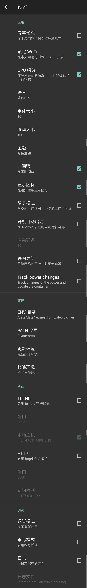
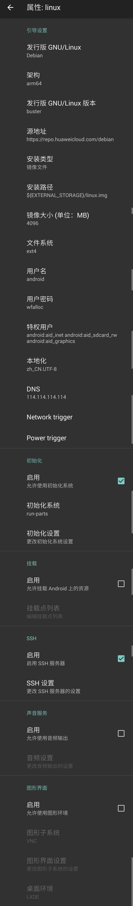

# LinuxDeploy

- [LinuxDeploy](#linuxdeploy)
  - [下载](#下载)
  - [安装后配置](#安装后配置)
    - [busybox](#busybox)
    - [linuxdeploy](#linuxdeploy-1)
  - [设置开机自启](#设置开机自启)
    - [编写启动脚本](#编写启动脚本)
    - [/etc/rc.local](#etcrclocal)
    - [添加可执行权限](#添加可执行权限)
  - [参考](#参考)

## 下载

[linuxdeploy](https://github.com/meefik/linuxdeploy/releases)

[busybox](https://github.com/meefik/busybox/releases)

## 安装后配置

### busybox

* 配置
  


* 安装
  


### linuxdeploy

* 设置
  


|设置 | 值 |
|--- |--- |
|屏幕常亮| 可选|
|锁定 WI-FI| 开启|
|CPU 唤醒|开启|
|语言|简体中文|
|ENV 环境|/data/data/ru.meefik.linuxdeploy/files|
|PATH 变量|busybox的安装地址（/system/xbin）|

> 环境变量配置完后，需要更新环境


* 配置文件
  


|设置 | 值 |
|--- |--- |
|Linux|Debian|
|架构|arm64|
|发行版本|buster|
|源地址|华为源-https://repo.huaweicloud.com/debian/|
|安装类型|镜像文件|
|安装路径|linux.img|
|镜像大小|自由设置，推荐 4GB|
|文件系统|默认|
|用户名|默认|
|用户密码|自由设置|
|特权用户|默认|
|本地化|zh_CN.UTF-8|
|DNS|114.114.114.114|
|初始化-启用|开启|
|SSH|开启|

> 配置完成后，执行安装。等待安装成功即可

## 设置开机自启

### 编写启动脚本

`/etc/init.d/` 目录中有启动的脚本。如一些服务未在其中，可加入到其中。

### /etc/rc.local

将程序执行命令加入到 `/etc/rc.local` 中。

如没有 `/etc/rc.local` 文件，可自己创建。文件内容如下

```shell
#!/bin/sh -e
#
# rc.local
#
# This script is executed at the end of each multiuser runlevel.
# Make sure that the script will "exit 0" on success or any other
# value on error.
#
# In order to enable or disable this script just change the execution
# bits.
#
# By default this script does nothing.

# 程序执行命令
​
exit 0
```

### 添加可执行权限

```shell
chmod +x /etc/rc.local
```


## 参考
[设置自启动nginx（适用于其他软件）（LinuxDeploy里的Ubuntu）](https://blog.csdn.net/banxian1988/article/details/101543754)